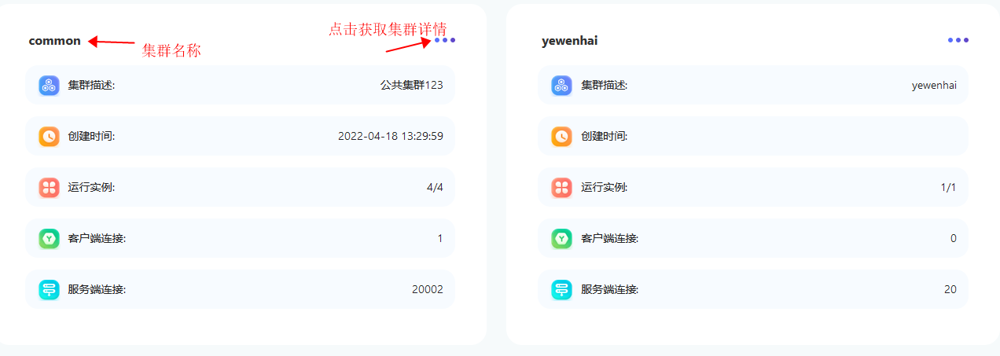
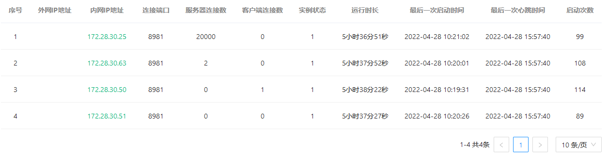
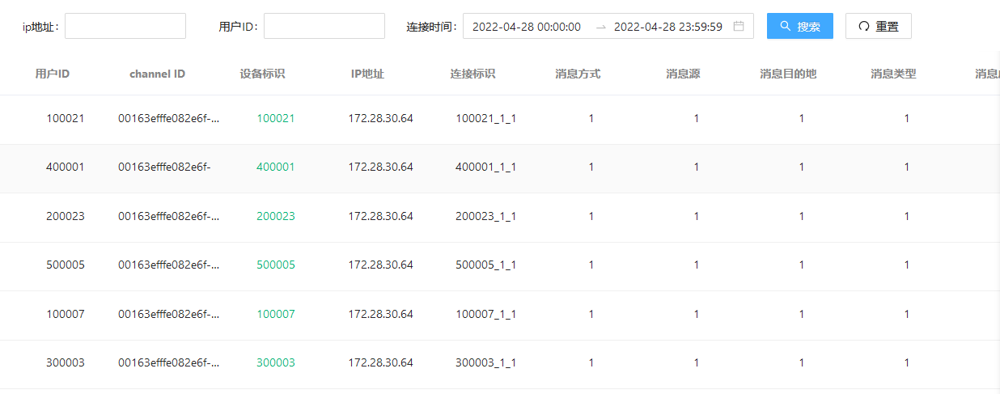
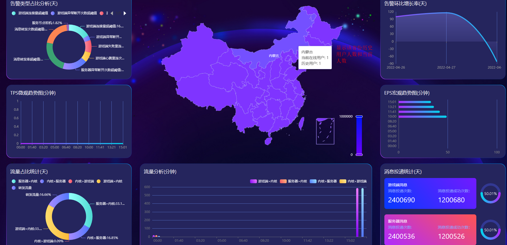
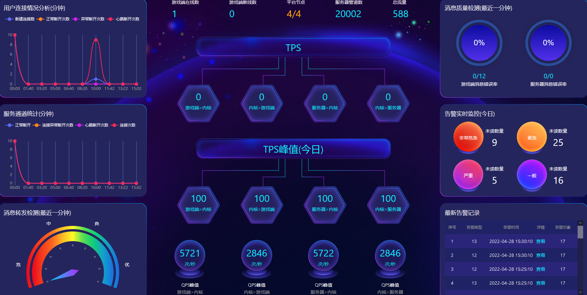

### netty100-集客户端SDK,监控预警等功能的企业级netty集群一站式监控预警平台
***
它具备以下特性:
- 跨集群: 可以同时监控多个集群
- 预警功能: 针对tps,eps,流量等指标进行预警
- 简单明了: 用户视图-集群列表,集群运行指标,预警状况直接展示;管理员视图-用户管理,集群,节点管理,集群分配
- 安全: 用户隔离,数据安全
- 更多特性正在开发当中
***
###功能概览
- 用户集群列表:不同的用户可以看到不同的集群,管理员可以管理所有的集群
  
- 集群详情: 分两块,节点详情,连接(客户端连接和业务端连接)详情  
   节点详情:
    
  连接详情
  
- 集群分配  
  
- 统计
   
- 监控
  
***
### 目前规模
    1.netty节点:
    2.客户端连接:
    3.服务器连接:
    4.每日消息量(次数):
    5.每日消息大小(MB):